# [AI Goat CTF Challenges](https://github.com/orcasecurity-research/AIGoat) Writeup
### *Machine Learning* | *AI Security* | *AI Red Teaming* | *Walkthrough* |

🐐 **DISCLAIMER** *Hints below!* 🐐

**Table of Contents**:
- [AI Goat CTF Challenges Writeup](#ai-goat-ctf-challenges-writeup)
    - [*Machine Learning* | *AI Security* | *AI Red Teaming* | *Walkthrough* |](#machine-learning--ai-security--ai-red-teaming--walkthrough-)
  - [Challenges:](#challenges)
    - [Gotcha's:](#gotchas)
- [**Challenge ML06:2023 AI Supply-Chain Attacks**:](#challenge-ml062023-ai-supply-chain-attacks)
    - [Objectives](#objectives)
    - [Writeup Solution](#writeup-solution)
- [**Challenge ML02:2023 Data Poisoning Attack**:](#challenge-ml022023-data-poisoning-attack)
    - [Objectives](#objectives-1)
    - [Writeup Solution](#writeup-solution-1)
- [**Challenge ML09:2023 Output Integrity Attack**:](#challenge-ml092023-output-integrity-attack)
    - [Objectives](#objectives-2)
    - [Writeup Solution](#writeup-solution-2)

## Challenges:

- ML02:2023 Data Poisoning Attack
- ML06:2023 AI Supply Chain Attacks
- ML09:2023 Output Integrity Attack

### Gotcha's:

I recommend you install terraform locally and don't advertise terraform operations on public repo workflows. See my [PR](https://github.com/orcasecurity-research/AIGoat/pull/4) contribution related to this.

Gather the values of your infrastructure in AWS with the `terraform output` command, ie for:

```terraform
output "frontend_url" {
  value = module.front.frontend_url
}

output "backend_ip" {
  value = module.webserver.backend_url
}

output "bucket_url" {
  value = module.front.bucket_url
}

output "rds_address" {
  value = module.webserver.rds_endpoint
}
```

Then, `terraform output aigoat-frontend-bucket-xxxxx.s3-website-us-east-1.amazonaws.com` and enter from the `/terraform` directory.

# **Challenge ML06:2023 AI Supply-Chain Attacks**:

### Objectives
Compromise the product search functionality using the file upload option to get the sensitive information file.

### Writeup Solution

Switch on Burp intercept, fuzz endpoints and perform API endpoint discovery recon.
**Don't narrow your scope / avoid not logging traffic in scope too much as some traffic is served over IPv4 non-FQDN**
Find the UI navigation to upload an image, looks juicy.
Identify a strange API endpoint during upload:

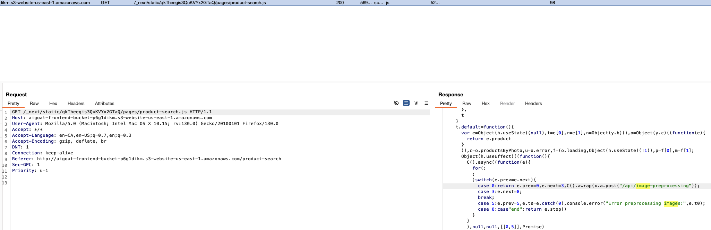

Try upload a `.jpg` and capture the response:

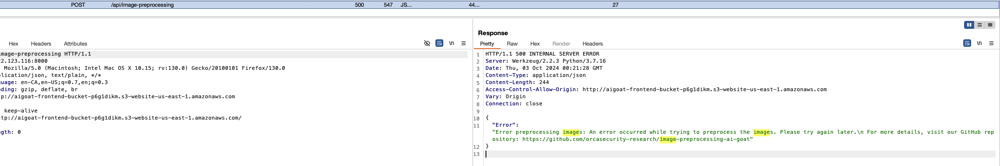

The code lives [here](https://github.com/orcasecurity-research/image-preprocessing-ai-goat/blob/main/image_preprocessing.py).
This code defines two functions for processing images and uploading data to an S3 bucket.
- `process_image(image_data)`: This function takes image data as input, opens it using the Pillow library, and extracts any metadata from the image's comments. If the metadata is a command, it attempts to execute it using the subprocess module, capturing the output. If the command takes too long (more than 5 seconds), it times out. Afterward, it resizes the image to 224x224 pixels and returns the image data as bytes.
- `create_s3_file(content, bucket, key)`: This function uploads the specified content to an AWS S3 bucket using the Boto3 library, which is a Python SDK for AWS services. It takes the content, bucket name, and key (file name) as parameters.
I'm getting some polygot thrilling vibes...

The default directory for an ec2 account is `ls -l /home/ec2-user`, let's see if we gain RCE/LFI, see [this](https://github.com/swisskyrepo/PayloadsAllTheThings) awesome payload collection for inspiration.
[See my example script](./polyglot_pil.py) and make the upload request to `POST /api/analyze-photo HTTP/1.1` and click "Search Products".

Dope.
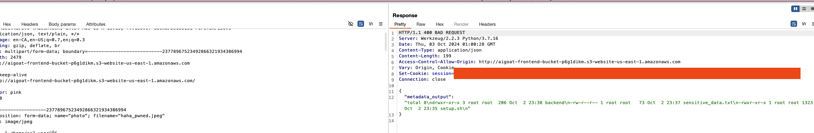

Now just update [my example script](./polyglot_pil.py) command with `cat /home/ec2-user/sensitive_data.txt`

`{user_recommendations_dataset: sagemaker-recommendation-bucket-xxxxx}` ✅

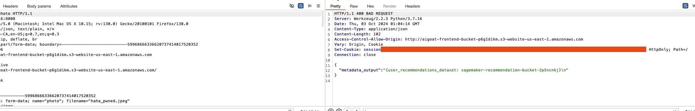

# **Challenge ML02:2023 Data Poisoning Attack**:

### Objectives
Manipulate the AI model to recommend a product - Orca Doll, which is not visible in the catalog for the provided user.

### Writeup Solution

Login with these credentials to view the recommendations:
```sh
user: babyshark
password: doodoo123
```

I found adding to the cart and checking the basket being the best method to verify this.

We kinda got a hint from the last challenge, the flag containing a bucket, [let's try enumerate it](https://github.com/zer1t0/awsenum):

```shell
    ➜  terraform git:(ads/local-tf-bucket-and-fix-deprecated-resources) ✗ aws s3 ls sagemaker-recommendation-bucket-xxxxx
    PRE code/
    PRE lambda/
    2024-10-02 19:35:27       2282 model.tar.gz
    2024-10-02 19:29:52       3485 old_product_ratings.csv
    2024-10-02 19:29:52       3492 product_ratings.csv
```

I pulled and enumerated all the files from the bucket, this one looks like training data:

```shell
➜  terraform git:(ads/local-tf-bucket-and-fix-deprecated-resources) ✗ aws s3 cp s3://sagemaker-recommendation-bucket-xxxxx/product_ratings.csv ./
download: s3://sagemaker-recommendation-bucket-xxxxx/product_ratings.csv to ./product_ratings.csv
```

I then spent some time and decided to see if I could grep match with Intruder for anything with "orci" against all the products as it mentions `Product ID` in the CSV file.

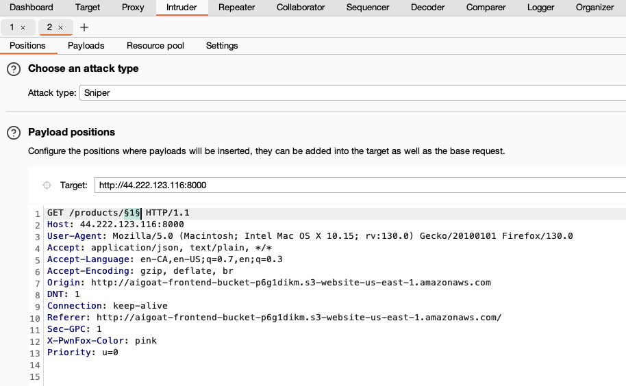
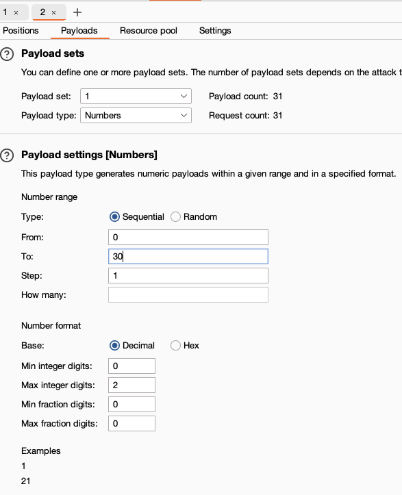
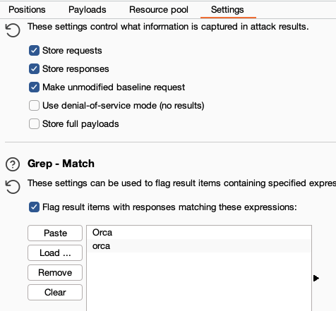

Dope, product ID = `2`.

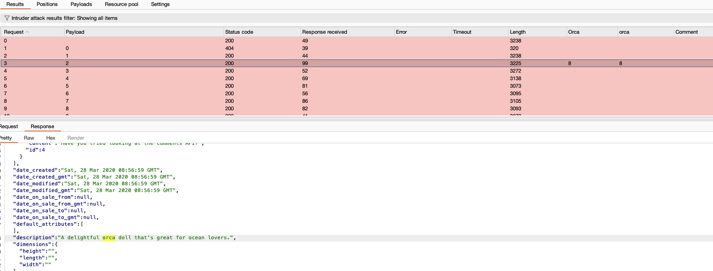

Abuse the dataset CSV to change all ratings to phenomenal for product 2 ([IE, front-running data poisoning](https://github.com/GangGreenTemperTatum/speaking/blob/main/dc604/hacker-summer-camp-23/Ads%20_%20Poisoning%20Web%20Training%20Datasets%20_%20Flow%20Diagram%20-%20Exploit%202%20Frontrunning%20Data%20Poisoning.jpeg)), example updated CSV attached.

Now all we need to do is upload that puppy:

```shell
➜  terraform git:(ads/local-tf-bucket-and-fix-deprecated-resources) ✗ aws s3 cp ./tainted_product_ratings.csv s3://sagemaker-recommendation-bucket-xxxxx/product_ratings.csv --acl bucket-owner-full-control  
upload: ./tainted_product_ratings.csv to s3://sagemaker-recommendation-bucket-xxxxx/product_ratings.csv
```

> The AI model takes a few minutes to learn your latest preferences...

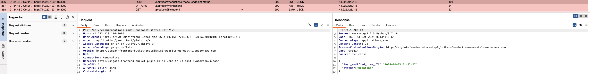

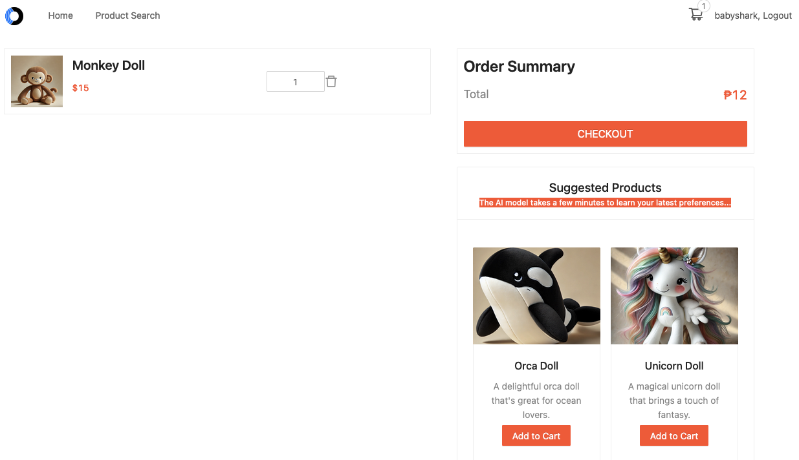

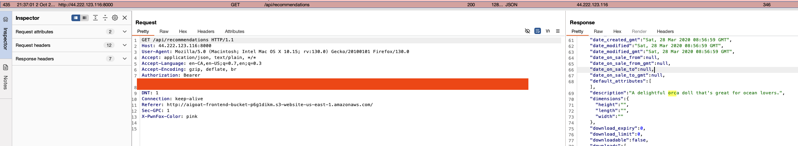 ✅

# **Challenge ML09:2023 Output Integrity Attack**:

### Objectives
Bypass the content filtering AI system to post on the Orca Doll product page the forbidden comment:
"pwned"
Success is achieved this comment that should be filtered gets published.

### Writeup Solution

Start with a bogus product comment to API endpoint, `POST /products/4/comments HTTP/1.1`. The first few times I noticed:

```json
{
  "error": "Error calling comment filter service"
}
```

A bit of brute-forcing and I don't think it accepts uppercaps, anyway I got the response `Comment is not allowed due to AI check`:

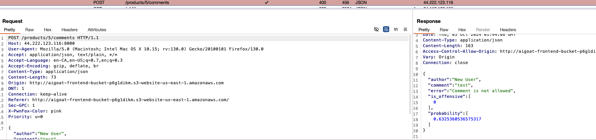

This seems like a perfect attack vector.
We know indexing starts at zero (0) and most commonly in these kinds of classifiers:

`0` = `False`
`1` = `True`

Throw the request into Burp Repeater and try by manipulating the request, or the in-flight request by the Interceptor works too.

`HTTP/1.1 201 CREATED` = Awesome.

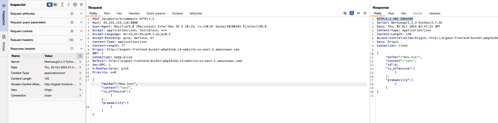

Send the intended payload:

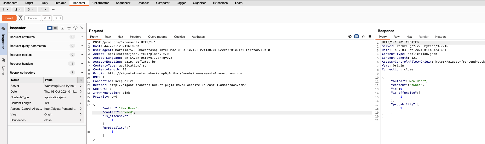

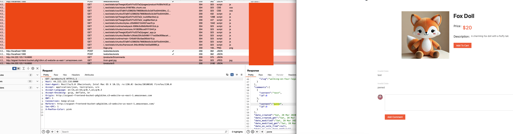 ✅
